# 中国国家博物馆之旅

> 2026年4月4日

---

## 1. 虢季子白盘

**年代**：西周晚期（约公元前9世纪，周宣王时期）

**来头**：与散氏盘、毛公鼎并称"西周三大青铜重器"，是西周时期体型最大的青铜盘

**为什么牛**：
- 盘底刻有 **111字铭文**，记录了虢季子白在洛水以北打败北方游牧民族猃狁，受周天子赏赐的经过
- 铭文字体优美，是西周大篆向秦系书法演变的重要过渡，书法家称其为**石鼓文的先声**

**外观**：形状像一个巨大的浴缸，圆角、敛口、平底，四个角有兽首衔环

**意义**：中国国家博物馆镇馆之宝之一，首批禁止出国（境）展览文物

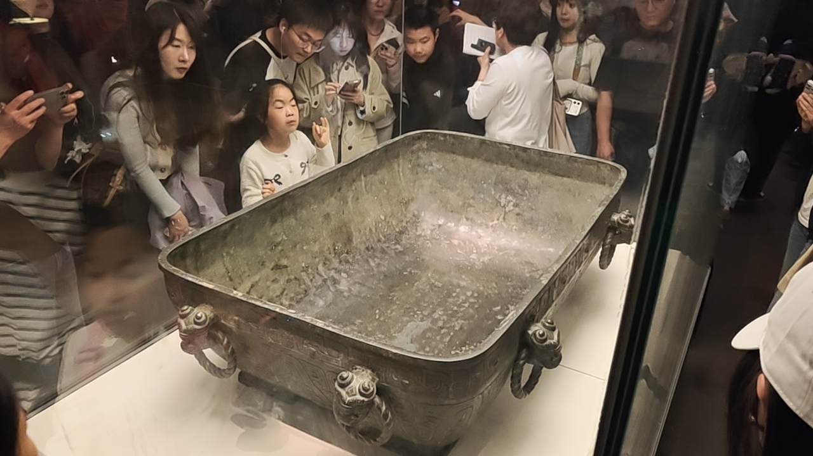

---

## 2. 虎纹青铜铙

**年代**：商朝后期（约公元前14世纪—前11世纪）

**出土地**：1959年湖南宁乡出土

**是什么**：古代青铜打击乐器，形状像大漏斗，口朝上，敲击发声

**为什么特别**：
- 铙身上有**精美的虎纹**（在口沿下方的装饰带）
- 主体是粗犷庄严的饕餮纹（兽面纹），典型的商代风格
- 湖南宁乡是著名的"青铜器之乡"

**意义**：
- 不仅是乐器，更是**权力和地位的象征**
- 体现了商代"礼乐制度"和精湛的青铜铸造技术

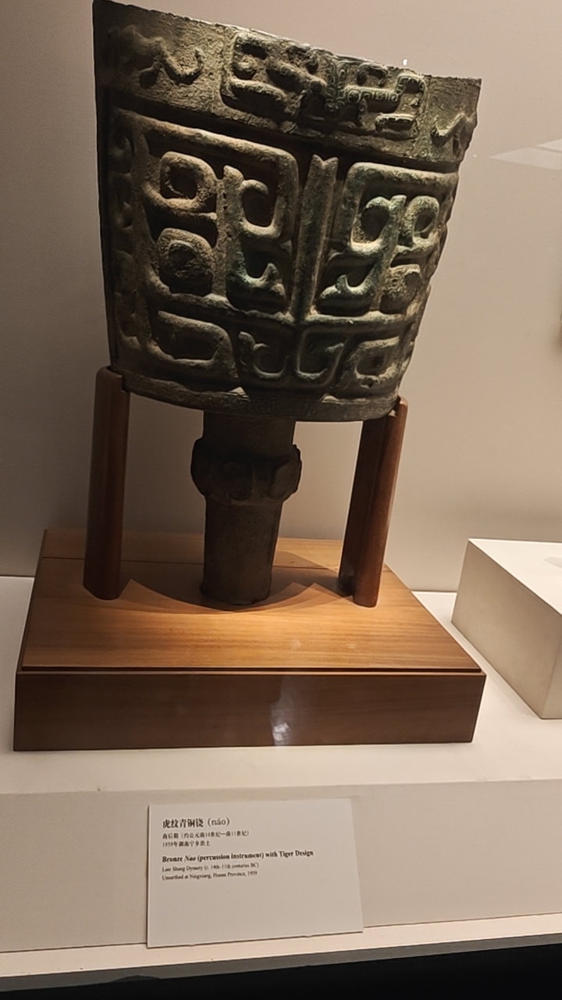

---

## 3. 四羊方尊

**年代**：商朝晚期（约公元前14世纪—前11世纪）

**出土地**：1938年湖南宁乡县黄材镇月亮山

**为什么是"臻于极致的青铜典范"**：
- 方尊腹部**四角各铸了一只卷角羊**，羊头和前胸突出于器表，羊角弯曲、双目炯炯有神
- 器身布满精美纹饰：蕉叶纹、夔龙纹、饕餮纹、云雷纹

**关于"羊"的寓意**：
- 古文中"羊"与"祥"通假，羊是**吉祥、仁义**的象征

**地位**：
- 中国现存商代**方尊中最大**的一件
- 中国国家博物馆镇馆之宝
- 首批**禁止出国（境）展览**文物

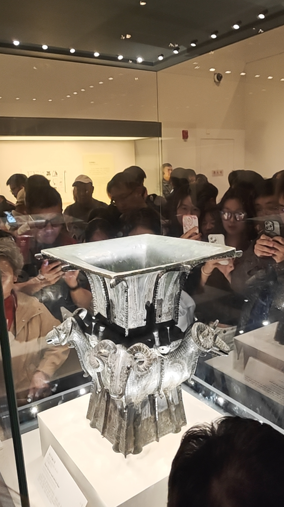

---

## 4. 龙虎纹青铜尊

**年代**：商代晚期（约公元前14世纪—前11世纪）

**出土地**：1957年安徽省阜南县出土

**是什么**：大型青铜盛酒器（尊），造型雄伟，喇叭状敞口，鼓起腹部，高圈足

**为什么特别**：
- 肩部有三个突出的**立体兽头**（龙头或虎头）
- 腹部有神秘的**龙虎纹**，呈虎口衔人的图案——这是商代青铜器上具有深厚宗教和权力象征的典型纹饰
- 布满了细腻的**云雷纹**做底纹，还有扉棱（垂直凸起棱脊）将器身等分

**意义**：
- 祭祀礼器，象征拥有者的地位、财富和与神灵沟通的权力
- 证明商代文化影响力已到达淮河流域
- 是研究商代社会结构、宗教信仰和南北文化交流的重要实物资料

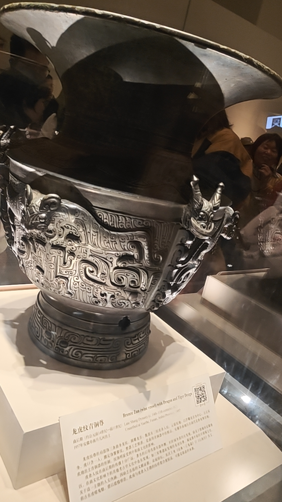

---

## 5. 青铜面具（三星堆）

**年代**：商代（约公元前16世纪—前11世纪）

**出土地**：1986年四川广汉三星堆出土

**外观**：
- 巨大的杏仁状**凸出眼睛**，眉毛粗大呈高浮雕状
- 嘴巴是一条深长的直线，嘴角略微向下，神情庄重神秘
- 巨大的耳朵向外张开，耳垂有方形小孔（用于悬挂或固定）
- 比真人脸大得多，超凡脱俗的力量感

**关于"纵目"**：有学者认为这代表了古蜀传说中的**蚕丛氏**（眼睛突出），是古蜀人崇拜的神灵或祖先

**意义**：
- 古蜀国文明的代表作，证明长江流域和黄河流域一样，都是中华文明的重要发源地
- 体现了3000多年前古蜀人卓越的青铜铸造技术
- 风格与中原商文化截然不同，充满了神秘和超现实色彩

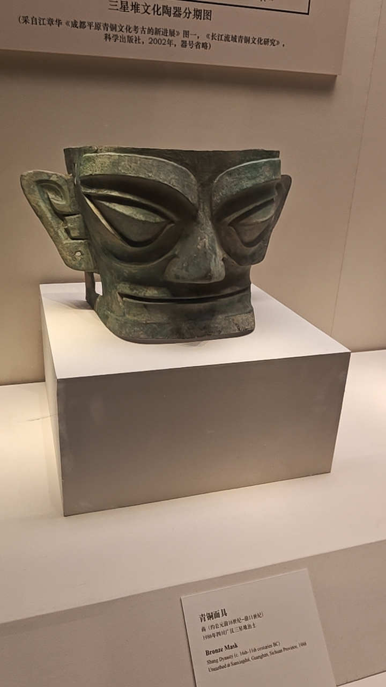

---

## 6. 青铜尊（三星堆）

**年代**：商代（约公元前16世纪—前11世纪）

**出土地**：1986年四川广汉三星堆出土

**器形**：典型的尊，圆口外撇像喇叭，鼓腹，高圈足

**看点**：
- 肩部有四个立体的**小鸟像**——这是三星堆青铜尊的特色
- 腹部和足部满饰**饕餮纹**，纹路深峻，富有立体感

**意义**：
- 证明古蜀文明与中原商文明有深刻交流（器形和饕餮纹来自商文化）
- 但肩部立鸟是古蜀地方特色，体现了独特的文化融合
- 用于重大祭祀仪式，反映古蜀人对神权的崇拜

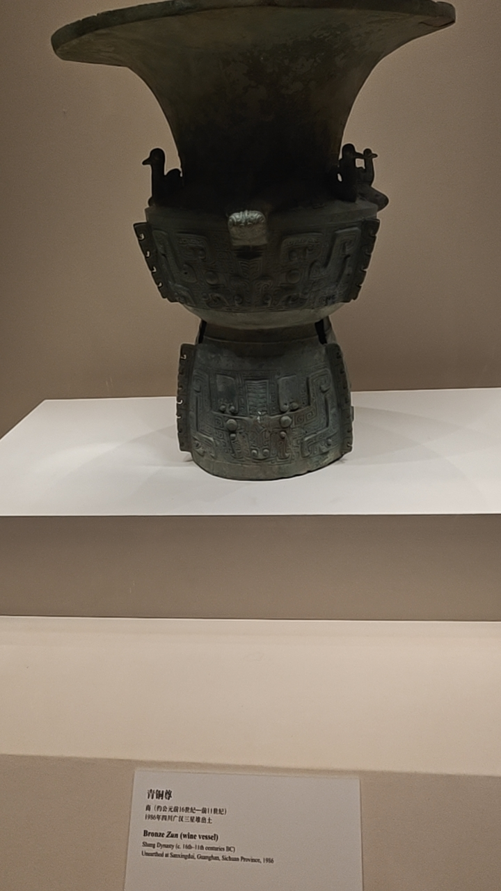

---

## 7. “令狐君孺子”青铜壶

**年代**：战国时期·韩国（公元前403年—前221年）

**出土地**：1927年河南洛阳出土

**外观**：
- 壶身椭圆鼓腹，长颈，带盖
- 盖子顶部装饰有向外舒展的叶状/花瓣状装饰（莲瓣盖）
- 壶身布满精细的几何纹或蝉纹
- 肩部两侧有圆环（铺首衔环），方便穿绳提拿

**铭文内容**：
- 壶颈刻有铭文，记载是**令狐君**后裔所铸
- 铸造目的：家族祈福，保佑家人健康长寿
- "令狐"是地名，位于今**山西省临猗县西南**

**意义**：
- 战国时期韩国（战国七雄之一）的遗物
- 是研究战国时期家族祭祀文化的重要实物

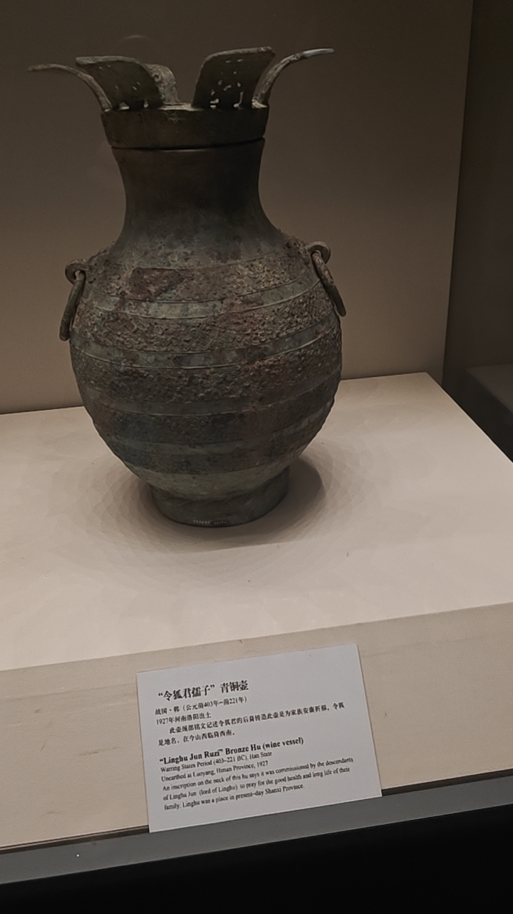

---

## 8. 春秋吴王青铜剑

**年代**：春秋时期（公元前770年—前403年）

**展出三把**：

### 1号：楚国青铜剑
- 1965年湖北江陵望山出土

### 2号：吴王夫差青铜剑（重点！）
- 传1935年安徽寿县出土
- 夫差是吴国最后一位君主（约公元前495-473年）
- 剑上刻有铭文：**"吴王夫差自作用剑"**

### 3号：吴王光青铜剑
- 1964年山西襄汾出土
- "吴王光"就是**阖闾**（夫差的父亲）
- 阖闾下令为自己铸造的随身武器

**为什么吴越剑最牛**：
- 吴越地区多河流山地，不适合战车作战，所以大力发展步兵近战的剑
- 通过调整铜、锡、铅、硫的比例，剑刃坚韧锋利，埋藏两千多年依然光洁如新
- 代表了当时青铜铸造的最高峰

**意义**：
- 带吴王铭文的剑是**王权与身份**的象征
- 出土于远离吴国故土（江苏、浙江）的地方，说明当时诸国之间的战争、结盟、贸易或战利品流转

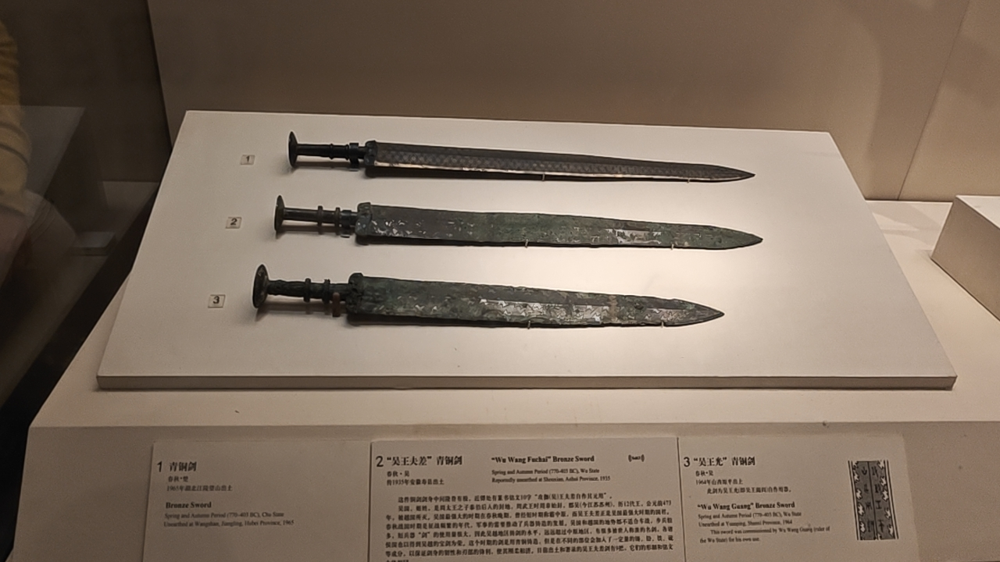

---

## 9. 曾侯乙铜鉴缶（古代冰箱）

**年代**：战国早期（公元前433年左右）

**出土地**：1978年湖北随州曾侯乙墓出土

**现藏**：湖北省博物馆

**外观**：
- 外层是方鉴（大方缸），内层套着方缶（酒壶）
- 表面布满密集的**蟠螭纹**（交织的小龙纹）
- 有龙形/兽形把手和装饰
- 底部有四个蹲伏小兽做足
- 配套有长柄青铜勺（用来舀酒）

**功能：世界上最早的"冰箱"和"空调"**：
- **夏天**：鉴和缶之间的空隙放**冰块**，酒就变冰凉
- **冬天**：空隙倒**热水**，可以**温酒**
- 设计精妙，底部有固定内缶的装置，盖子严丝合缝

**意义**：
- 采用复杂的**失蜡法**、分铸法和焊接工艺
- 是曾侯（曾国国君）身份地位的象征
- 中国**首批禁止出国（境）展览**文物之一
- 国宝中的国宝！

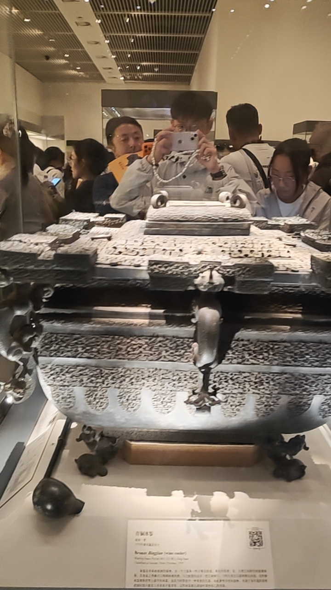

---

## 10. “曾仲斿父”青铜方壶

**年代**：春秋早期（约公元前770年—前403年）

**出土地**：1966年湖北省京山县（今京山市）苏家垄出土

**所属**：曾国

**外观**：
- 方壶造型，器身较高
- 壶盖顶部有四个巨大的向外张开的**叶状/冠状装饰**（很威风！）
- 颈部两侧有兽首耳，耳中衔有活环
- 器身装饰着**波曲纹**（环带纹）和**重环纹**

**铭文**：
- 盖内和颈部铸有铭文
- 记载这是"**曾仲斿父**"（曾国高级贵族，排行老二）自作的祭祀礼器

**意义**：
- 成对出土，苏家垄墓群出了多件"曾仲斿父"铭文的青铜器
- 对于研究曾国历史、疆域、周王朝与南方诸侯国关系有重要价值
- 造型端庄大气，顶部冠状装饰极具视觉冲击力

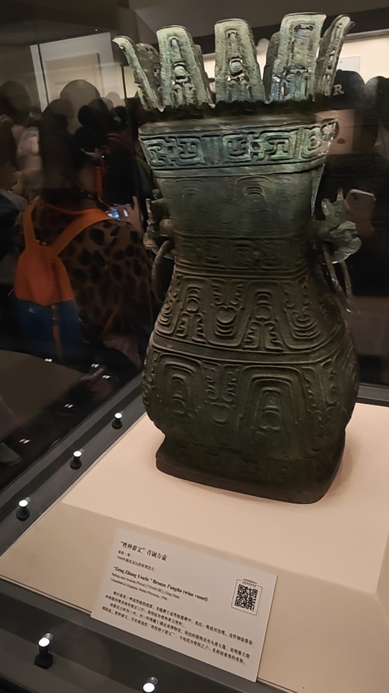

---

## 11. 春秋青铜布币

**年代**：春秋时期·晋国（公元前770年—前403年）

**出土地**：1956年山西侯马出土（晋国都城"新田"所在地）

**是什么**：
- 青铜铸铲形货币，**"布币"**是古人对"铲子"的称呼
- 左侧5枚："平肩弧足空首布"（顶部有中空銎，用于安装木柄）
- 右侧10枚：体型稍大的空首布

**演变来源**：
- 布币是从原始农业工具**"钱"（即铲子）**演变而来的
- 最早是实用的铲子，后来慢慢变成标准化的货币

**钱币上的文字**：
- 铸有地名或序号，如"东"、"四"、"成"、"甘坂少化"、"宅"等
- 这些是地名或铸造标记

**意义**：
- 中国古代最早的金属铸币形式之一
- 反映了春秋时期晋国商业贸易的繁荣
- 是研究中国早期货币史和经济史的珍贵实物

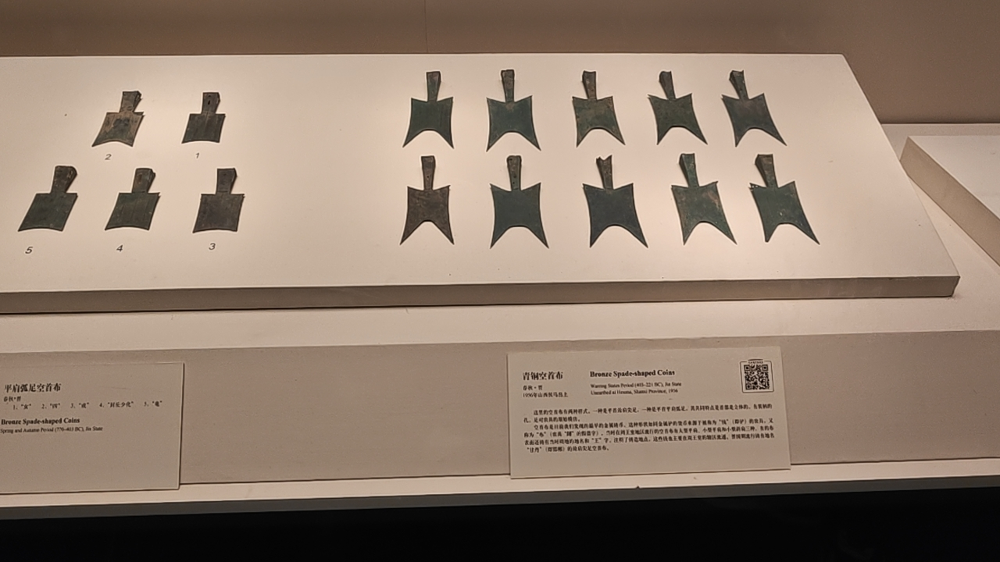

---

## 12. “王命传”青铜虎节

**年代**：战国·楚国（公元前403年—前221年）

**出土地**：传安徽寿县出土（寿县曾是楚国都城"郢"）

**外观**：
- 老虎伏卧姿态，身体修长，头微抬，尾上卷
- 虎身饰有精美的**错金工艺**

**是什么**：
- "节"是中国古代的**通行凭证**，类似于现代的通行证或身份证
- 凭此节可以出入关驿，获得食宿、马匹或通行许可

**铭文**：
- 虎节身上铸有铭文
- 说明持有者可以享受什么待遇

**意义**：
- 展示了战国时期楚国高超的**青铜铸造和错金工艺**
- 是研究古代交通制度、邮传系统的重要实物
- 铭文对研究古文字演变和官制很重要

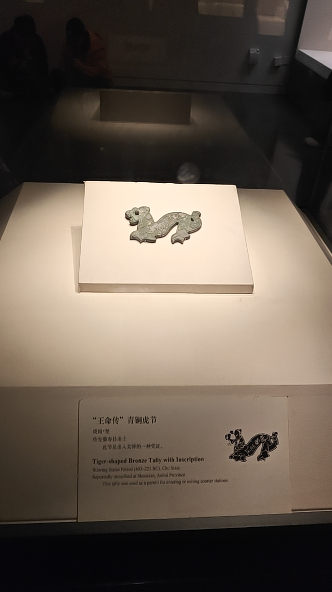

---

## 13. 战国编钟

**年代**：战国时期（公元前475年—前221年）

**出土地**：常见于湖北、河南等地的楚墓或曾国墓葬

**外观**：
- 大小不一的青铜钟，按音调高低排列（从小到大）
- 悬挂在一个**黑红漆木架**上（典型的战国/楚文化风格）
- 钟体表面有精美花纹（蟠螭纹/云雷纹）和"枚"（钟乳状突起，用于调节音律）
- 配套有**丁字形木槌**用于敲击

**为什么牛**：
- 每口钟能发出**两个不同音阶**（双音钟），世界音乐史上的独一无二
- 证明2000多年前中国就有完整的**七声音阶体系**
- 音域宽广，能演奏复杂乐曲

**意义**：
- **礼乐制度**的核心，只有王室或高级贵族才能使用
- 象征权力和地位
- 是中国古代灿烂音乐文化的见证

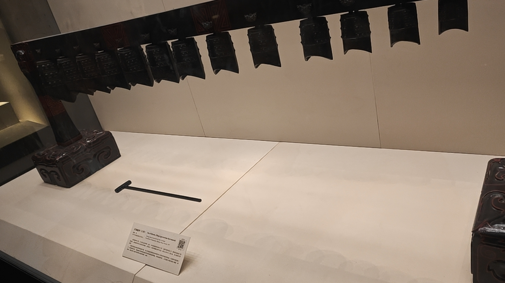

---

## 14. 春秋晋国青铜方壶

**年代**：春秋·晋国

**出土地**：1982年山西太原金胜村（赵卿墓）

**外观（非常华丽）**：
- 壶盖顶部有高耸华丽的**透雕花冠**（镂空的，像翻腾的云气或盛开的花）
- 颈部修长，装饰交龙纹和云雷纹
- 颈部两侧有向外伸出的**龙形耳**（把手）
- 壶腹布满凹凸感极强的**交龙纹**
- 整体体型巨大（高约80-90厘米）

**工艺**：
- 用到了**失蜡法**或分铸技术
- 顶部透雕花冠是当时极高超的铸造技术体现

**意义**：
- 代表春秋时期晋国青铜工艺的顶峰
- 体现了从西周庄严厚重向灵动、繁缛风格的转变
- 是研究晋国"赵卿墓"高级贵族生活的重要实物

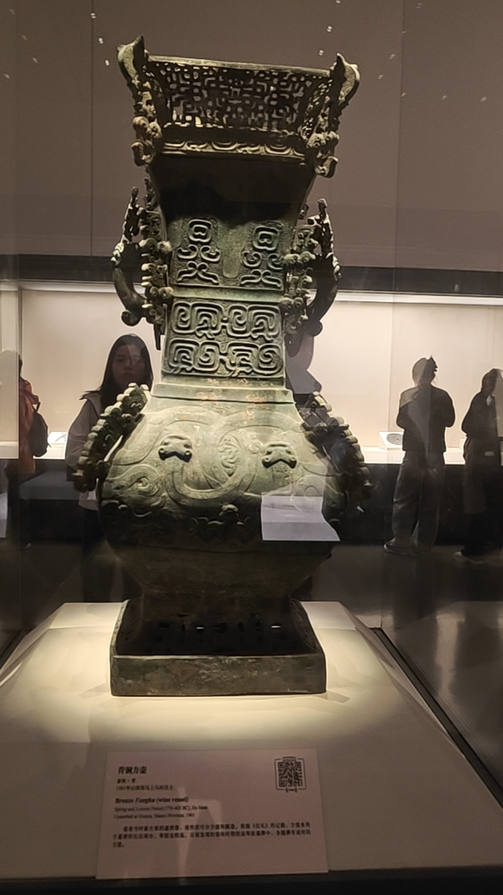

---

## 15. 金缕玉衣

**年代**：汉代（西汉—东汉，约公元前202年—公元220年）

**外观**：
- 由数千片磨制精细的小玉片组成（长方形或正方形）
- 玉片用**金丝**（金缕）编缀在一起
- 分为**头部、上衣、裤筒、手套、鞋**五部分
- 旁边通常还有**玉枕**

**等级制度**：
- 只有**皇帝**才能用金缕玉衣
- 诸侯王、列侯根据等级用银缕或铜缕
- 这件金缕的，主人是最高统治阶层

**背后的思想**：
- 古人认为**玉能使尸体不腐**
- 做这件衣服是为了保护死者遗体，让灵魂升仙、长生不老
- 体现了汉代的"永生崇拜"

**意义**：
- 汉代皇室奢华生活和至高权力的集中体现
- 是中国古代**玉器工艺**和**金属加工工艺**结合的巅峰之作

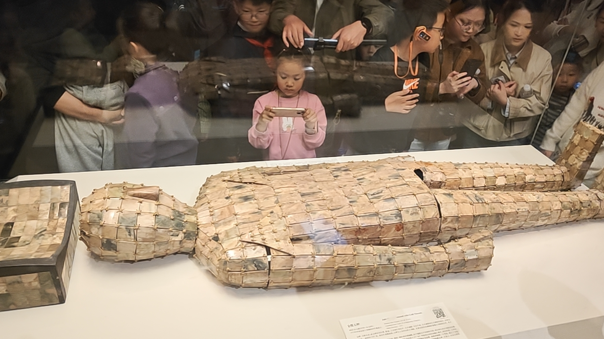

---

## 16. 西汉彩绘雁鱼青铜灯

**年代**：西汉（公元前202年—公元8年）

**外观**：
- 鸿雁回首衔鱼的造型
- 雁颈修长，大眼圆睁
- 雁背上驮着圆柱形灯罩
- 原本有丰富的彩绘装饰（红、绿、白等色）

**构造（可拆卸）**：
- 雁衔鱼 + 灯罩 + 灯盘 + 雁身，四部分组成
- 都可以拆开，方便清洗

**黑科技——古代环保灯**：
- 雁颈内部是空的，与雁腹相通
- 点灯时，油烟顺着雁颈导入盛水的雁腹中
- 烟尘经过水过滤冷凝，沉积在腹内
- **比欧洲类似的环保设计早了1000多年！**

**还能调节光线**：
- 灯罩由两片弧形屏板组成，可以左右转动
- 既能挡风，又能调节光线的强弱和方向

**寓意**：
- 大雁 = 守信、吉祥
- 鱼 = 富足
- "雁衔鱼"是汉代人美好生活的向往

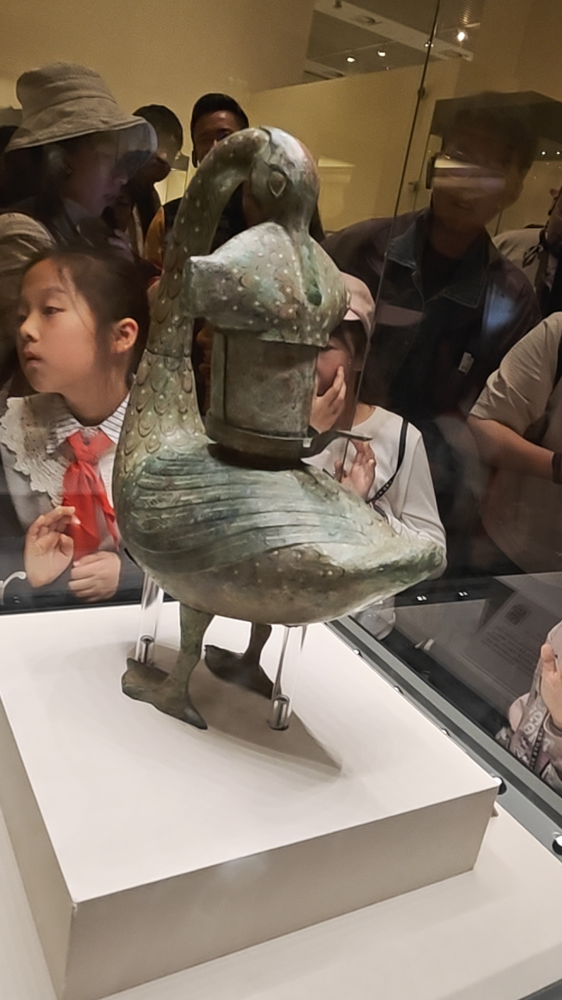

---

## 17. 东汉庖厨侍女陶俑

**年代**：东汉（公元25年—220年）

**出土地**：四川地区（典型的"蜀地汉俑"）

**三个陶俑，从左到右**：

**① 侍女俑**：
- 头戴花形发饰，面带微笑
- 右手托小杯，左手端盘子（盘中放着圆形点心）
- 正在侍奉饮食

**② 厨师俑**：
- 戴冠帽，跪坐在案几后
- 案上摆满各种食材（像是在处理肉或鱼）
- 神情专注，很忙的样子

**③ 捣米俑**：
- 女性，头戴花形发饰
- 双手握杵，在石臼里捣东西（谷物或调味品）

**背后的思想**：
- 这些是**冥器**（随葬品）
- 古人说"事死如事生"——希望死后也能享受生前的待遇
- 把厨房场景搬进坟墓，让死者在阴间也能被服侍

**意义**：
- 研究汉代社会生活、饮食文化、服饰发式的珍贵实物
- 与秦俑的严肃写实不同，汉俑充满生活情趣，生动传神

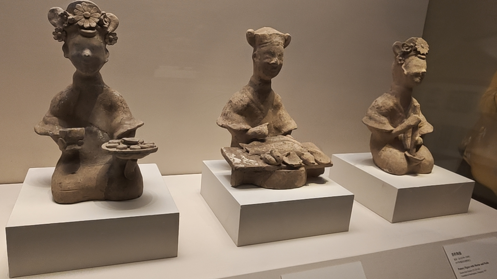

---

## 18. 博物馆里的小朋友

**这张不是文物，是一张很温馨的照片** 📸

**场景**：
- 两个小朋友（一男一女）趴在展柜前，全神贯注地盯着文物
- 女孩还用手指着展品，好像在说"你看这个！"
- 周围都是大人（家长或导览员）
- 通过玻璃倒影能看到整个博物馆熙熙攘攘的人群

**背景里的文物**：是三件**越窑青瓷**小动物（辟邪/狮子/鹿造型），三国两晋南北朝时期的

**为什么这张值得留**：
- "博物馆作为第二课堂"的最好体现
- 孩子们清澈的眼神，和2000年前的文物对视
- 文化的传承，就是这样一代一代发生的

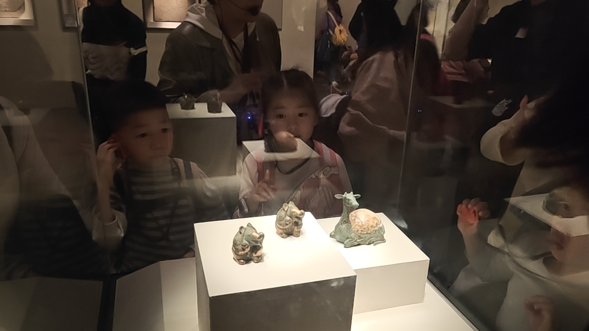

---

## 19. 绿釉陶水亭

**年代**：东汉（公元25年—220年）

**出土地**：陕西西安灞桥区三里村出土

**结构**：上下两部分

**下部（水池）**：
- 大圆形浅陶盆，象征水池
- 池边有陶塑水鸟、家畜（如狗）
- 池内有几个人像，其中一人在撑船或劳作

**上部（两层亭阁）**：
- **一层**：展示了汉代典型的**"斗拱"**结构
- **二层**：有围栏，里面站着乐手、歌舞者、武士
- **亭顶**：四角攒尖顶，有宝顶装饰，屋脊有飞鸟

**釉色**：汉代典型的**绿釉**（以铅为助熔剂，深绿色）

**功能**：
- 典型的**明器**（随葬品）
- 反映了东汉豪强地主阶级的**百戏、歌舞演出场景**
- 亭内有乐手吹琴、有人伴唱有人守卫

**意义**：
- 是汉代木构建筑的**微缩模型**，为研究2000年前中国建筑结构提供了珍贵实物
- 展示了汉代**斗拱**雏形
- 体现了东汉庄园经济的繁荣

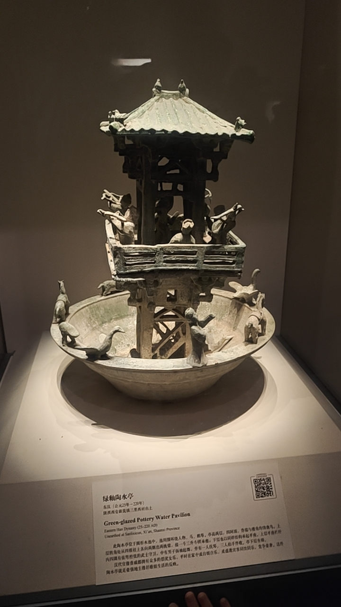

---

## 20. 东汉"狩猎生产图"画像砖

**年代**：东汉（公元25年—220年）

**出土地**：四川地区（成都、彭州一带）

**材质**：陶土烧制

**画面内容（分上下两部分）**：

**上部：山林狩猎**
- 连绵起伏的山峦（形似"博山"造型）
- 山林间有鹿、野猪、飞鸟等
- 猎人张弓搭箭，或追逐奔跑的野兽

**下部：生产建筑**
- 两层或多层木结构建筑（可能是盐井架/井车）
- 人们从事各种劳动：农耕、采盐、捕鱼
- 还有马车/行人运送物资

**艺术手法**：
- 汉代特有的**浅浮雕**手法
- **散点透视**和分层构图

**意义**：
- 研究汉代社会经济、生产工具（弩、井车）、生活习俗的珍贵实物
- 体现了东汉四川地区繁荣的盐业和狩猎经济
- 反映了汉代人"人与自然和谐共处"的天人合一思想

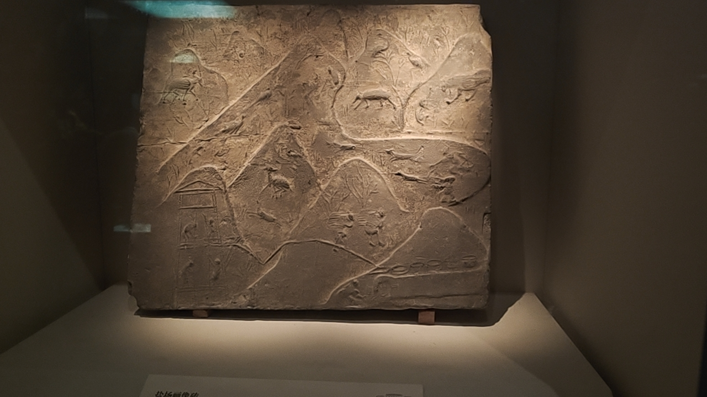

---

## 21. 汉代"平索戏车"画像砖

**年代**：汉代（公元前202年—公元220年）

**出土地**：河南地区

**画面内容**：

**主体结构**：
- 中央是一座造型优美的**拱桥**，桥面有护栏纹饰
- 桥下有一叶小舟，跨越河流

**"平索戏车"杂技（重点！）**：
- 画面左侧有一辆行驶的马车，车上竖立高竿
- 竿顶有艺人表演平衡
- 竿子两侧伸出绳索（"平索"），多名艺人在绳索上悬挂、翻腾
- 这是汉代"**百戏**"的重要组成部分

**车马出行**：
- 数辆马车和骑马者飞奔，浩浩荡荡
- 右侧有穿长袍的人物拱手作揖，迎接或观看

**边框装饰**：上下边缘有汉代典型的菱形几何纹

**意义**：
- 研究汉代**杂技史、马戏史**的重要实物
- 反映了汉代贵族奢华的生活和等级礼仪
- 是汉代"百戏"文化的珍贵见证

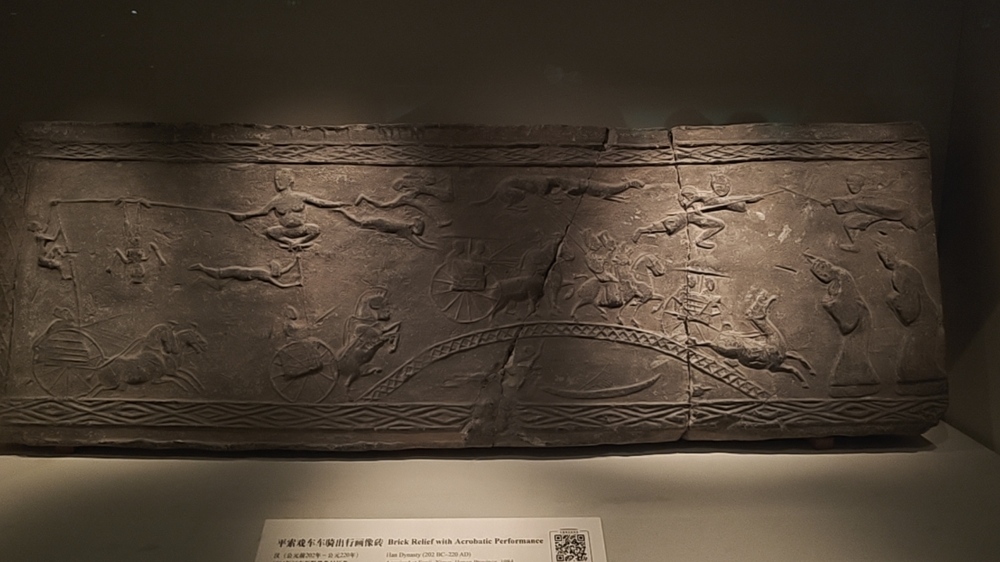

---

## 22. 东汉击鼓说唱俑

**年代**：东汉（公元25年—220年）

**出土地**：1957年四川成都天回山崖墓

**外观**：
- 蹲坐地上，右腿踢起，左手环抱圆鼓，右手高举（原本有鼓槌，现已缺失）
- 头戴软帽，上身赤裸，露出圆润腹部
- **表情极其诙谐**：额头皱纹，眉开眼笑，嘴巴大张露出舌头，仿佛在说"瞧好吧您呐！"

**地位**：
- 被誉为**"汉代第一名俑"**
- 中国国家博物馆顶级国宝

**意义**：
- 证明了2000多年前说唱艺术在中国已经非常成熟
- 体现了汉代雕塑从庄重向**生动写实**转变的风格
- 反映了汉代劳动人民**幽默乐观**的生活态度
- 是研究汉代"百戏"和民间说唱艺术的珍贵实物

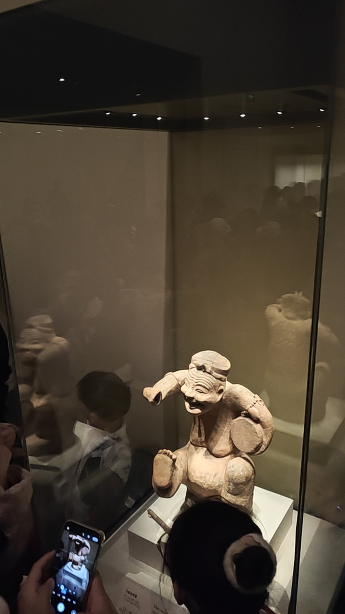

---

## 23. 东汉红陶击鼓说唱俑（另一尊）

**年代**：东汉（公元25年—220年）

**材质**：红陶

**出土地**：四川成都

**外观**：
- 蹲坐姿态，左臂下夹扁圆鼓，右手高扬（原应有鼓槌）
- 左足前踢，足尖上翘
- 头戴帻，额头有褶皱纹路
- **表情诙谐**：眯眼张口，咧嘴大笑，仿佛正讲到精彩段落
- 赤裸上身，露出浑圆腹部

**与上一尊的区别**：
- 上一尊是灰陶，这一尊是**红陶**
- 姿态细节略有不同
- 都是同类型的"击鼓说唱俑"

**意义**：
- 汉代"俳优"（说唱艺人）的真实写照
- 体现了汉代雕塑"**以神写形**"的极高造诣
- 通过夸张手法捕捉表演者瞬间的精气神
- 是汉代乐观豁达精神的象征

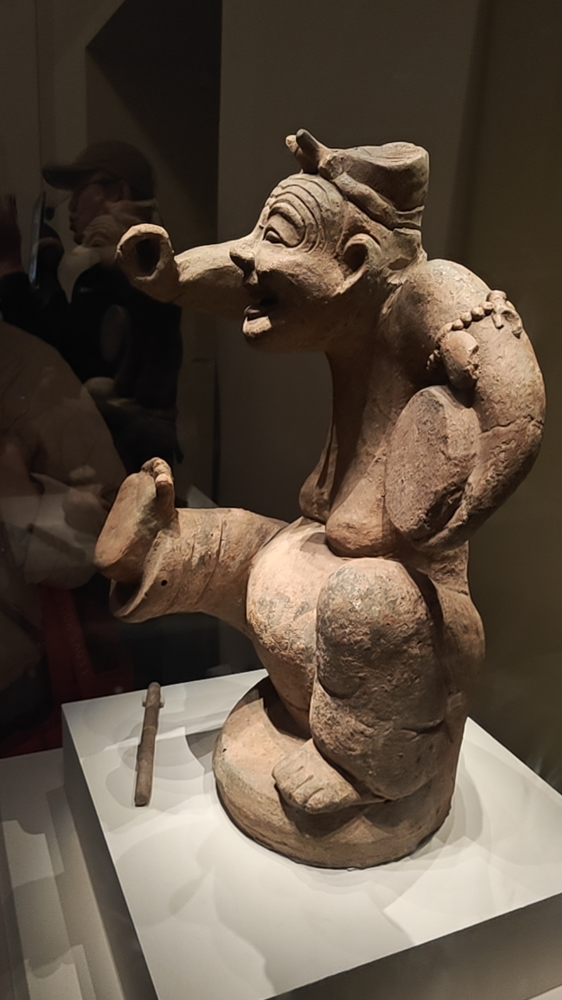

---

## 24. 西汉"贮贝器"（古滇国）

**年代**：西汉（公元前202年—公元8年）

**出土地**：云南晋宁石寨山、江川李家山（滇文化墓葬）

**外观**：
- 器身呈腰鼓形，上大下小，中间微收
- 器身有爬行状的**虎/豹形附件**
- **器盖是精华**：密密麻麻的小型圆雕人物，描绘祭祀、战争、劳作场面
- 中央有歇山顶式建筑（祭堂）
- 左右两侧有按比例缩小的**铜鼓**模型

**用途**：
- "贮贝"= 储存贝币 = **存钱罐**
- 滇国贵族用这个装货币，也是权力和地位的象征

**为什么牛**：
- **滇人没有文字**，但他们用青铜器"写"历史
- 器盖上的人物雕塑相当于"**立体史书**"
- 祭祀、杀俘、收割、织布……2000年前的社会全刻在上面了
- 反映了古滇国与中原汉文化、东南亚文化的交融

**意义**：
- 代表了古滇国文明的最高艺术水平
- 是研究西南地区古代民族的珍贵实物

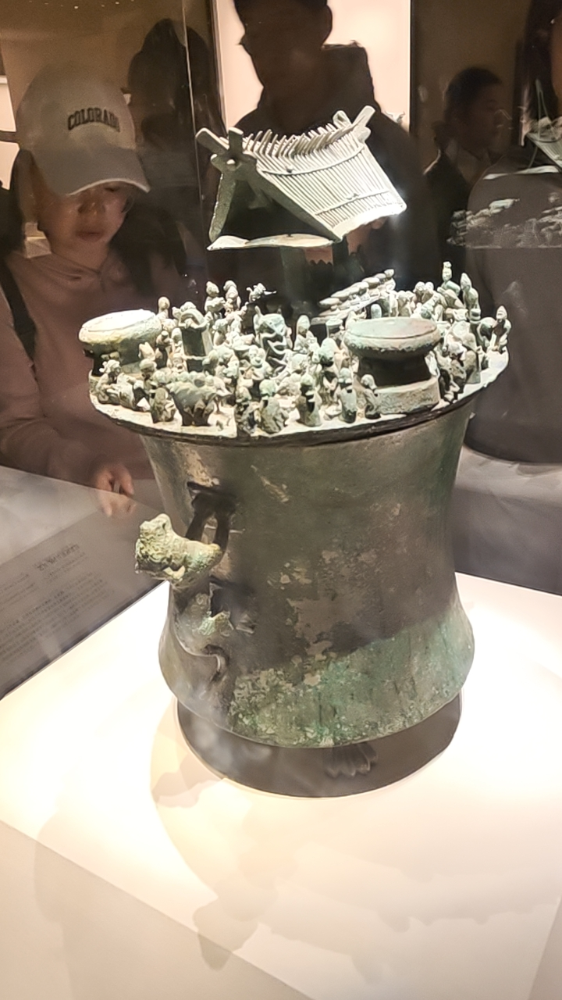

---

## 25. 北朝陶俑阵列

**年代**：北朝（约公元4世纪—6世纪，包括北魏、东魏、西魏、北齐、北周）

**展品内容**：

**① 甲骑具装俑（重装骑兵）**：
- 前排最显眼，战马全身披挂厚重铠甲
- 骑马者也穿盔甲，戴高冠
- 是北朝时期军事力量的代表

**② 武士俑与文官俑**：
- 成整齐方阵排列
- 头戴长冠或褶裙帽，身穿宽袖长袍或戎装
- 双手交叠胸前，表情庄重

**③ 陶牛车**：
- 背景中可见贵族出行交通工具
- 牛车在北朝是身份象征

**意义**：
- "**甲骑具装**"是中国古代重装骑兵的巅峰
- 反映北朝时期民族大融合、战争频繁的历史
- 胡汉文化交融——服饰和马具都能看出来
- 从秦汉到隋唐陶俑过渡期的艺术风格

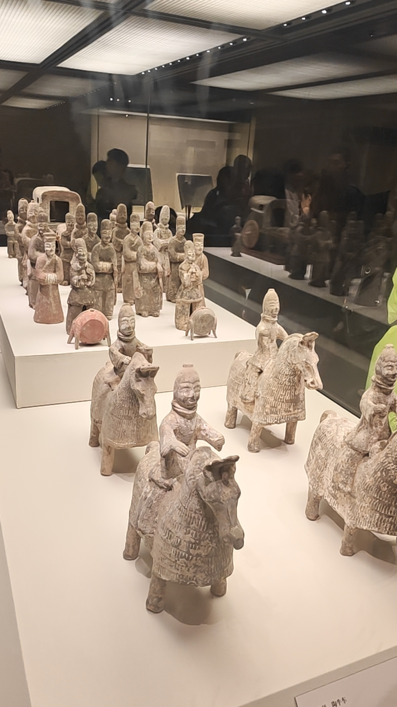

---

## 26. 三国·吴 青瓷羊形烛台

**年代**：三国·吴（公元222年—280年）

**出土地**：1958年江苏南京清凉山出土

**外观**：
- 造型为一只蹲伏的羊，形体丰满，神态安详
- 羊头顶有圆孔，用于插蜡烛（烛台功能）
- 羊角卷曲，昂首张口
- 身上有装饰性刻纹

**釉色**：青绿色，半透明质感，典型的早期越窑青瓷

**学术争议**：
- 有学者认为是**烛台**
- 也有学者认为是**盛水器**

**工艺**：
- 胎质匀净，釉胎结合紧密
- 反映了三国时期较高的制瓷水平

**寓意**：
- "羊"与"祥"通假，寓意**吉祥**
- 将日用品做成动物形状，体现实用与审美的结合

**意义**：
- 南京作为六朝古都，出土了大量精美青瓷
- 是研究三国时期东吴青瓷工艺的重要实物

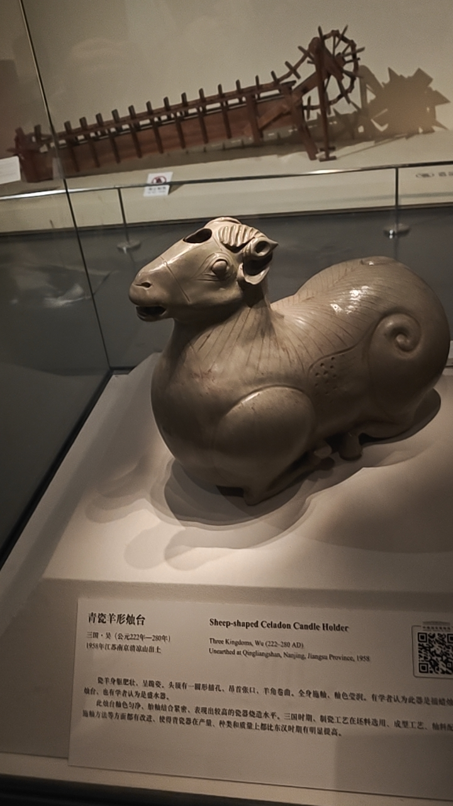

---

## 27. 北朝 青瓷莲花尊

**年代**：北朝（约公元386年—581年）

**出土地**：江苏南京或山东一带的北朝贵族墓葬

**外观（极其华丽）**：
- 体型巨大，通体施青绿釉
- **顶部**：圆锥形瓶盖，顶端是含苞莲蕾，盖面有多层莲瓣
- **颈部/肩部**：颈部粗，肩部有六个桥形系（耳）
- **腹部（精华）**：多层凸雕莲瓣——上下各两层，上部的莲瓣朝上，下部的覆莲瓣向外翻卷，立体感极强
- **底部**：莲瓣状底座，整件器物像一朵巨大的莲花托着瓶身

**工艺**：堆塑、贴花、划花等多种高难度技法

**为什么牛**：
- 被称为**"青瓷之王"**
- 在唐代秘色瓷和宋代名瓷之前，北朝青瓷莲花尊代表了早期瓷器的最高工艺

**佛教意义**：
- 莲花是佛教象征，寓意"净土"和"圣洁"
- 北朝佛教大发展，莲花纹样极其流行
- 这件器物具有宗教信仰意义

**意义**：
- 是皇室或高级贵族才能拥有的随葬礼器
- 象征墓主人的显赫地位

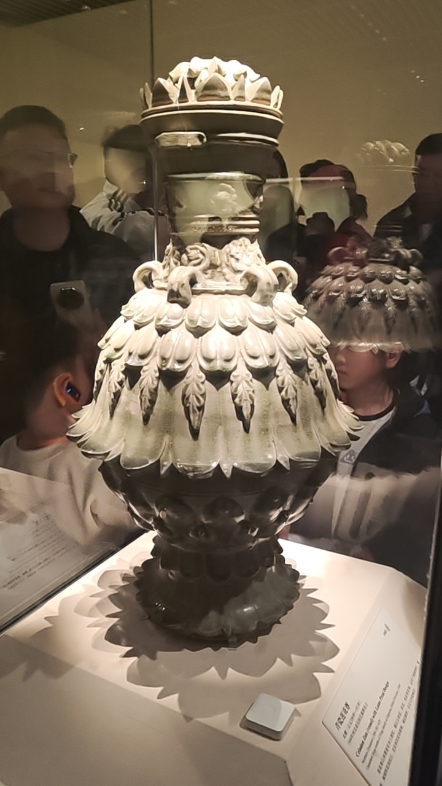

---

## 28. 唐三彩骆驼载乐俑

**年代**：唐代（约公元8世纪，盛唐时期）

**出土地**：陕西西安周边的唐代墓葬（如中堡村唐墓）

**外观**：
- 一只昂首站立的**双峰骆驼**，张口仰头，仿佛正在鸣叫
- 驼背铺着色彩斑斓的毯子（绿色、黄色、白色）
- 毯子上有**方形平台**，坐着四名身穿胡服的乐师
- 乐师分别抱着琵琶、箜篌、笛子等乐器
- 平台中央还站着一名**胡人**（西域人），留胡须，正翩翩起舞或引吭高歌

**工艺——唐三彩**：
- 低温铅釉陶器，釉色以黄、绿、白为主
- 色彩流淌自然，形成华丽斑斓的效果

**为什么牛**：
- 被视为盛唐"**丝绸之路**"文化融合的代表性符号
- 骆驼=丝绸之路的主要交通工具
- 胡人乐师+胡乐乐器=中西文化交流的繁荣

**意义**：
- 体现了唐朝博大包容的文化胸怀
- 长安城汇聚世界各地商人、艺术家、音乐
- 为研究唐代音乐形态、乐器种类提供珍贵实物

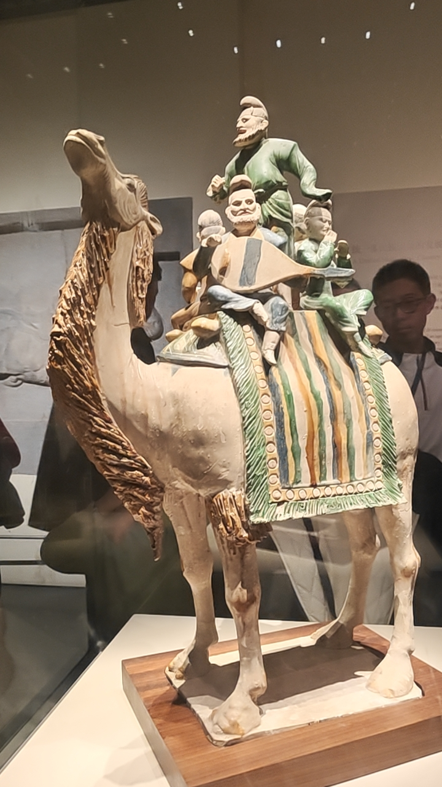

---

## 29. 五代后梁 彩绘浮雕武士石刻

**年代**：五代十国·后梁（公元907年—923年）

**出土地**：1994年河北曲阳县西燕川村**王处直墓**

**现藏**：中国国家博物馆

**外观**：
- 威风凛凛的武士，高浮雕
- 面庞圆润，神态威严，有**唐代遗风**
- 头戴束发金冠，身披华丽**明光铠**
- 双手交叠按在剑柄上，剑尖垂直向下

**最独特的地方**：
- **头顶神鸟**（凤或朱雀），羽翼丰满
- **足踏走兽**（麋鹿或牛状异兽）
- "头顶神鸟、足踏走兽"的设计，充满神话色彩

**功能**：
- 原本在王处直墓前室门洞两侧，充当**"门神"**
- 驱邪避灾，守护墓主安宁

**艺术价值**：
- 继承了盛唐雍容大度的风格
- 开启了宋代细腻写实的先河
- 是**唐宋变革期**石雕艺术的代表作

**坎坷经历（比文物更戏剧性）**：
- 1994年王处直墓**被盗**，这两块石刻被锯下走私出境
- 2000年其中一块出现在纽约拍卖行
- 中国政府通过国际合作**成功追回**
- 是中国通过国际公约成功追索的**第一件珍贵文物**！

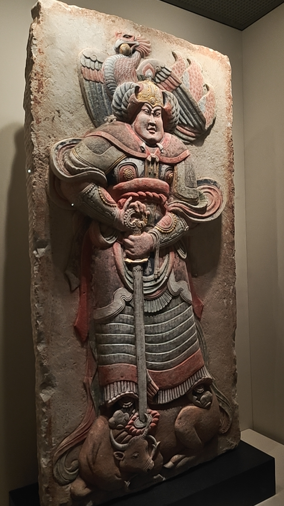

---

## 30. 唐三彩侍女俑

**年代**：唐代（开元十一年，公元723年）

**出土地**：1957年陕西西安**鲜于庭诲墓**

**外观**：
- 站立女性形象，身份为侍女
- 神情端庄，身姿挺拔，双手在胸前合捧圆形物件
- 穿着以**绿色**为主的长袍，点缀白色纹饰
- 梳着典型唐代高发髻（翻荷髻或云髻）
- 领口较低，体现唐代开放自信的风气

**唐三彩工艺**：
- 绿、白、赭（黄）多种釉料高温烧制
- 釉色流淌自然，斑驳交错
- 侍女头部不施釉，用"开脸"工艺描绘面部

**为什么牛**：
- 距今约1300年，依然色彩绚丽
- 记录了唐代女性的审美标准和时尚
- 那种圆润自信的气质，是大唐盛世的写照

**意义**：
- 是"冥器"，古人"事死如事生"观念
- 展现了唐代社会开放自信的风气
- 代表了中国古代低温铅釉陶器的最高艺术水平

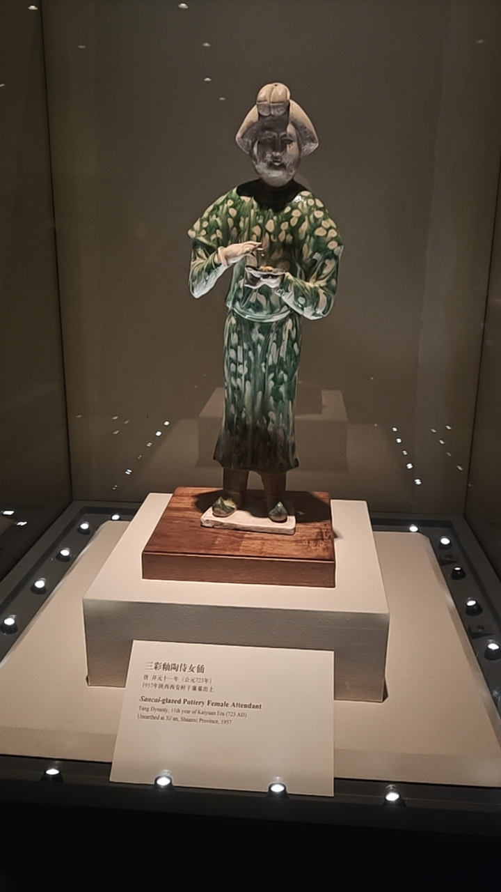

---

## 31. 唐三彩镇墓兽

**年代**：唐代（公元618年—907年）

**出土地**：通常是唐代贵族墓葬

**外观（威猛）**：
- 蹲坐姿态，面部狰狞，双目圆睁，嘴大张露齿
- 头顶有高耸的角状或**火焰状装饰**
- 背部生有羽翼般的装饰
- 前肢直立，后肢蜷缩
- 釉色以绿、黄、白为主（唐三彩）

**背景墙上还有**：
- "三彩天王俑"介绍
- 天王俑与镇墓兽成对出现，共同守卫墓葬

**镇墓兽的作用**：
- 放置在墓道或墓室门口
- 狰狞外貌驱赶邪恶魔鬼，保护死者安宁

**演变历史**：
- 起源于战国，流行于魏晋至唐代
- 唐代时演变成这种夸张威猛的神兽形象

**文化融合**：
- 结合了中国本土怪兽形象 + 外来佛教/西域艺术元素
- 体现了唐代丝绸之路带来的中西文化交流

**意义**：
- 只有达官显贵的墓才能用这么精美的三彩镇墓兽
- 是墓主身份地位的象征
- 反映了唐代开放包容的文化

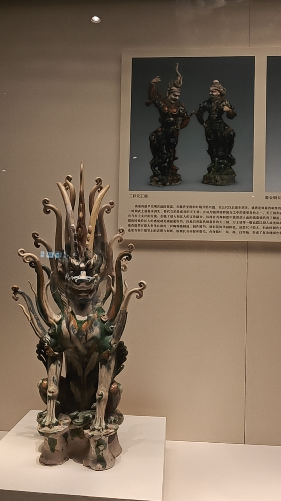

---

## 32. 唐三彩陶马

**年代**：唐代（盛唐时期，公元618年—907年）

**外观**：
- 昂首挺胸，双耳竖立，神情警觉从容
- 四肢稳稳站立，肌肉线条清晰
- 马身米白色釉（白釉为主）
- 背上披着绿色毯状装饰（障泥）
- 头戴复杂络头，额前有花饰
- 胸前和后躯挂着串珠状装饰，垂挂铃铛或杏叶饰物

**工艺——唐三彩**：
- 黄、绿、白等色釉交替使用
- 这匹是**白釉绿花**配色

**马在唐朝的意义**：
- 马是**国家实力**的象征
- 贵族用于战争、打猎、马球
- 反映了唐代"厚葬"的社会风气

**艺术价值**：
- 造型比例协调，动静结合
- 体现了唐代大气磅礴、自信开放的审美
- 是研究唐代马具、服饰、畜牧业的重要实物

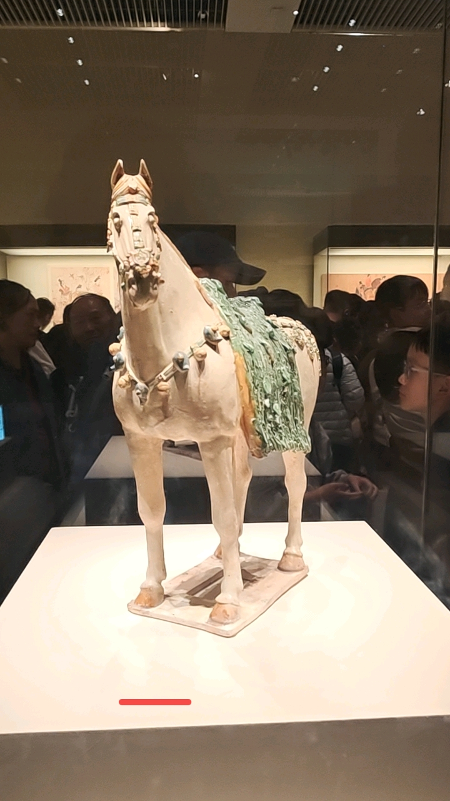

---

## 33. 水月观音金铜造像

**年代**：宋/元时期（艺术巅峰期）

**材质**：青铜或黄铜（鎏金），表面古铜色

**外观**：
- **游戏坐**姿态（一腿盘起，一腿垂下，重心后倾）
- 右手搭在膝盖上，左手撑在身后，神态宁静自在
- 头戴华丽**宝冠**（冠中有化佛——阿弥陀佛）
- 身披璎珞，斜披帛带，下着长裙
- 身后有巨大的**圆形背光**，顶部有火焰纹装饰
- 坐于山石之上，底座模仿岩石和波浪（象征普陀洛迦山）

**水月观音的由来**：
- 唐代开始出现，相传由画家**周昉**首创
- 表现观音菩萨观水中月影、悟佛法真谛的意境
- 寓意"诸法如水中月、镜中花，虚幻不实"

**艺术价值**：
- 佛教中国化的典型代表
- 将神性威严与女性柔美结合（宋代后观音多呈女相）
- 摆脱了早期造像的刻板僵硬，注重写实和人文情感

**宗教意义**：
- 观音象征大慈大悲、救苦救难
- 自在坐姿向信众传递平和、解脱的精神状态

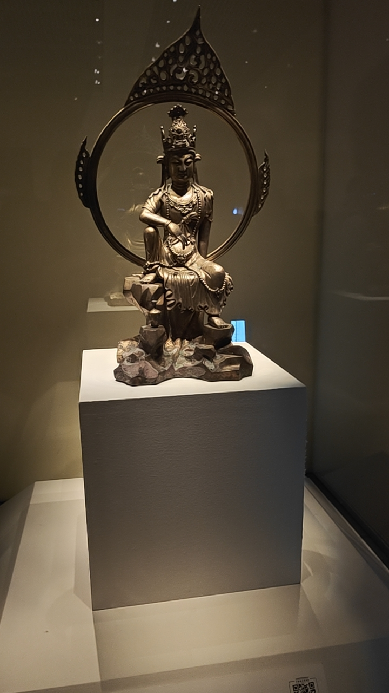

---

## 34. 宋代钧窑玫瑰紫釉花盆

**年代**：宋代（公元960年—1279年）

**出土地**：河南禹州（钧窑窑址）

**外观**：
- 宽大撇口（口沿外翻），腹部圆润，线条流畅
- 外壁是厚润的**玫瑰紫釉**，紫红交织，有斑斓窑变效果
- 内壁是淡淡的**青蓝色/天青色**
- 内外色彩对比鲜明

**钧窑特色——"入窑一色，出窑万彩"**：
- 钧窑打破了宋代以前青瓷、白瓷色彩单一的格局
- 开启了**彩色釉瓷**的新时代
- 窑变效果是自然化学反应，每件作品的纹理色彩都独一无二

**钧窑的地位**：
- **宋代五大名窑**之一（汝、官、哥、钧、定）
- 部分精美钧窑是专门为**宫廷**烧造的
- 皇室审美和地位的象征

**技术成就**：
- 利用**铜的还原反应**产生红、紫色调
- 精准掌控窑炉火候
- 展示了宋代工匠对釉料配方的高超水平

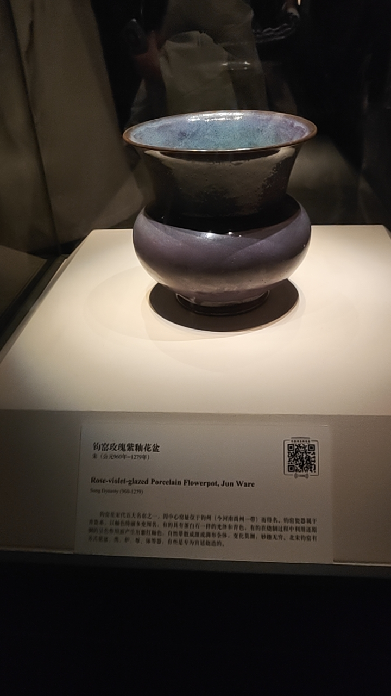

---

## 35. 元代铜壶滴漏（古代"时钟"）

**年代**：元代（公元1316年，元延祐三年）

**出土地**：广州（由广州工匠冼祥、晏子亮等铸造）

**原置于**：广州南门城楼（拱北楼），为全城百姓提供标准时间，使用了数百年

**结构（四层，从上到下）**：
- **日壶**（顶层）：最大的受水壶
- **月壶**（第二层）：承接日壶的水
- **星壶**（第三层）：承接月壶的水，壶身有**星宿图案**（如北斗七星）
- **受壶**（最下层）：底部有带刻度的铜尺（"箭"）

**工作原理**：
- 水从日壶逐级滴入下层壶
- 多级缓冲使水流速度保持恒定
- 受壶内水面升高，浮舟带动刻度箭尺上升
- 读取箭尺刻度即可测定时间

**纹饰**：
- 壶身铸有**云龙纹、波浪纹**
- 星壶有**星宿图案**（象征天文学在计时中的核心地位）
- 受壶有**八卦符号**（乾、坤、震、巽等）

**技术成就**：
- 利用**流体力学**原理
- 四级滴漏解决了水压变化导致流速不均的问题
- 大大提高了计时准确性

**意义**：
- 中国现存最早、最完整、体型最大的多级漏壶
- 为全城提供标准时间，用了数百年
- 融合了天文学、数学、力学和传统哲学（八卦、阴阳）

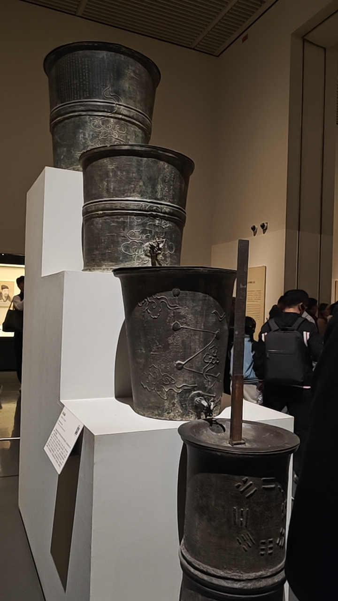

---

## 36. 明代斗彩瓷器

**年代**：明代（多为成化/宣德年间，15世纪）

**两件并排展示**：

**① 斗彩人物纹小杯（左侧）**
- 撇口、深腹、小圈足，尺寸小巧（马蹄杯类型）
- **斗彩工艺**：青花勾勒轮廓，釉上彩（红、绿、黄）填色
- 纹饰：山石花草间有古代人物（文人雅士或仙人）

**② 斗彩高足杯（右侧）**
- 杯身碗状，下接圆柱形长柄
- 同样斗彩工艺
- 纹饰：缠枝花卉纹或葡萄纹

**斗彩工艺——两次烧制**：
1. 先在胎上用青花料勾勒轮廓，高温烧成**釉下彩**
2. 在轮廓内填入各种颜色的低温彩料
3. 再次入窖**低温烘烤**

**为什么牛**：
- 斗彩是明代官窑巅峰技艺
- 追求"釉下青花"与"釉上五彩"争奇斗艳、和谐统一
- 皇帝专用，是权力和至高审美的象征

**斗彩名人**：成化斗彩最负盛名，娇小玲珑，釉质如脂

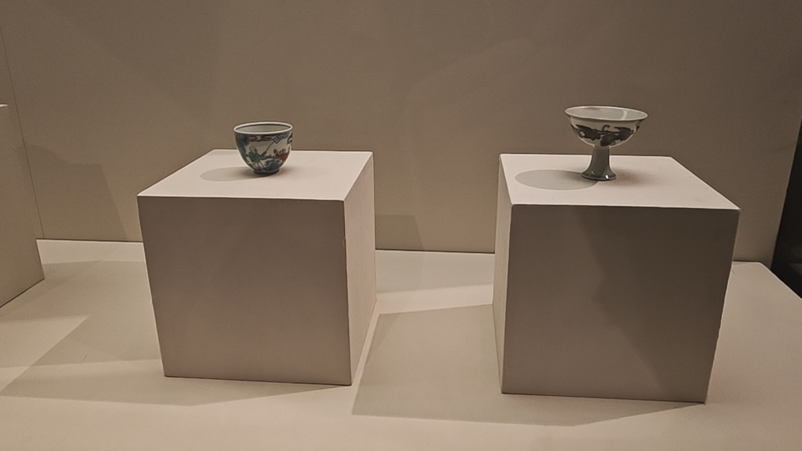

---

## 37. 清代"皇帝之宝"玉印

**年代**：清代（公元1644年—1911年）

**材质**：碧玉

**外观**：
- 上方是精美的**交龙纽**（两条龙缠绕在一起，龙首向前，威严庄重）
- 下方是平整的长方形印台

**印面文字**：
- 刻有满、汉两种文字的**"皇帝之宝"**
- 满文和汉文左右并列——满汉合璧的典型形式

**用途**：
- **皇权象征**
- 皇帝发布诏令、处理政务的重要凭证

**制度背景**：
- 秦代：皇帝"六玺"（六枚印章）
- 汉代：沿袭六玺制度
- 清代：乾隆皇帝进一步规范，确立"**清二十五宝**"
- 这枚"皇帝之宝"是其中重要成员

**意义**：
- 象征皇帝至高无上的权力
- 体现清代高超的玉石雕刻工艺
- 反映满汉文化融合的统治特色

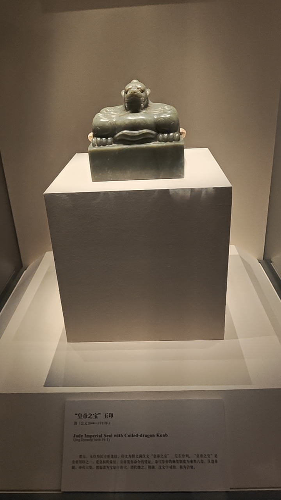

---

## 38. 清乾隆 霁蓝釉金彩海晏河清尊

**年代**：清乾隆（公元1736年—1795年）

**出产**：景德镇御窑厂，为圆明园海晏堂专门烧制

**外观**：
- 撇口、短颈、丰肩、鼓腹，器型稳重大气
- 施**霁蓝釉**（祭蓝），深沉静穆，如深海般湛蓝
- 颈肩部对称装饰两只白色浮雕**燕子**（"海晏"的谐音）
- 尊身有精美**金彩**（描金）——腹部下有海浪纹，上有缠枝花卉/云纹
- 足部一圈粉色、绿色**莲瓣纹**，与深蓝形成对比

**"海晏河清"的寓意**：
- "海晏"= 大海平静
- "河清"= 黄河水清
- 象征**天下太平、国泰民安**

**"谐音梗"**：
- **燕**子 = "晏" = 大海平静
- 整体组合成"**海晏河清**"——对大清江山的美好祝愿

**地位**：
- 乾隆时期景德镇御窑厂巅峰之作
- 代表了当时制瓷工艺的**最高水平**

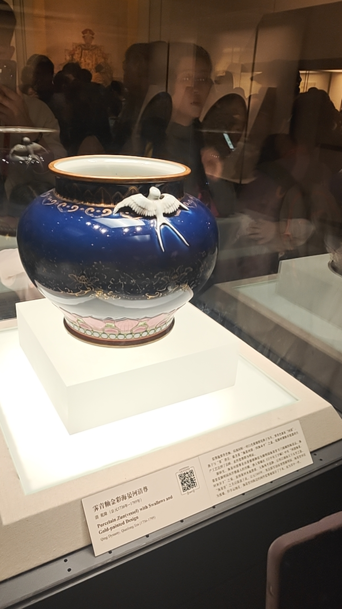

---

## 39. 清乾隆 粉彩镂空转心瓶

**年代**：清乾隆（公元1736年—1795年）

**出产**：景德镇官窑

**外观（极其复杂）**：
- 由**内外两层**组成（外瓶 + 内胆）
- 外瓶腹部是精细的**镂空设计**（透雕），透过镂空能看到内胆
- 瓶颈部：深红色底，绘金色和蓝色花纹
- 瓶腹部：浅绿色/天蓝色底，满布缠枝花卉纹
- 镂空部分：复杂的如意纹或几何纹

**转心瓶的玄机**：
- 内外瓶分开烧制，再套叠在一起
- 内瓶**可以转动**——"转心瓶"因此得名
- 这种工艺要求极高，是特种工艺瓷

**地位**：
- 乾隆时期景德镇官窑为博取皇帝欢心而研制
- 被誉为**"瓷中之王"**
- 代表了清代瓷器工艺的**最高成就**

**画面里有**：
- 一个戴口罩的小男孩俯身观察
- 一个扎辫子的小女孩凝视
- 体现了现代人与古代艺术精品的跨时空对话

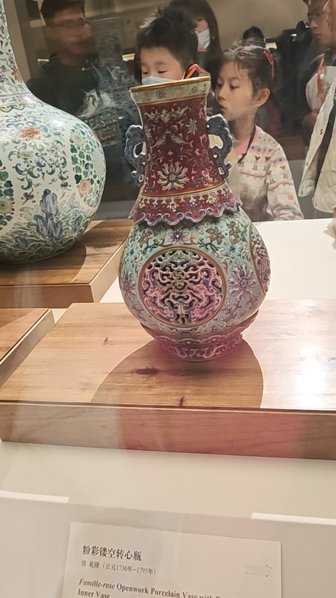

---

## 40. 清代天球仪

**年代**：清道光十年（公元1830年）

**制作者**：齐彦槐（1774-1841）

**材质**：金属，深古铜色

**外观**：
- 球体表面刻有精细的**星图和星座**
- 由多重环形轨道组成的支架系统（类似赤道环、地平环）
- 四个弯曲的金属足支撑
- 配有**钥匙状工具**——用于给内部机械上发条

**功能**：
- 内部仿照**钟表原理**，用"钢磅"（发条）作为动力
- 可以**自动运转报时**
- 是一个能模拟天体运行的精密计时仪器

**制作者齐彦槐**：
- 清代著名科学家
- 擅长天文学、水利学和数学

**意义**：
- 体现了中国传统天文学 + 西方机械钟表技术的**结合**
- 是研究清代天文学观测和计时技术的重要实物
- 展示了鸦片战争前夕中国本土科学家的创新能力

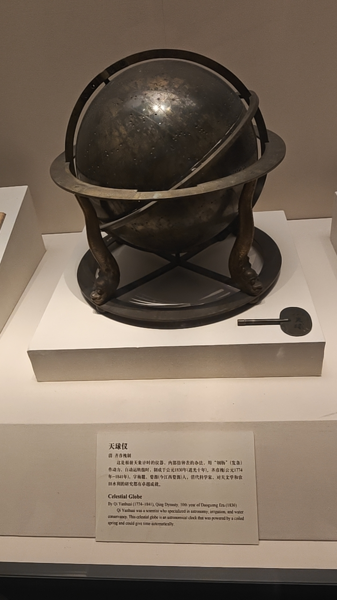

---

## 41. 三星堆青铜大立人像

**年代**：商代晚期（约公元前1200年—前1100年），距今约3000年

**出土地**：四川广汉三星堆遗址

**外观（极其震撼）**：
- 整体高度约**2.62米**（含底座），世界上现存最高、最完整的古代青铜人像之一
- 被称为**"东方巨人"**

**人物特征**：
- 头戴高冠，冠上有精美纹饰
- 典型的三星堆风格面部：巨大杏圆眼、宽阔嘴巴、方正下颌
- 耳朵上有耳洞

**服饰**：
- 身穿三层窄袖长袍
- 袍上布满龙纹、云雷纹、几何纹样

**姿势**：
- 双臂环抱于胸前，双手握成环状
- 左右手不在同一直线上
- 推测手中原本握有祭祀法器（象牙、琮或权杖，已遗失）

**底座**：
- 赤足站立在四个神兽头支撑的方座上
- 方座下方还有方形基座

**身份推测**：
- 代表古蜀国**集神权与王权于一身**的最高领袖
- 大祭司或国王

**意义**：
- 证明了古蜀文明是高度发达的独特区域文明
- 与中原商文明有交流互动
- 是中华文明"多元一体"起源的重要物证

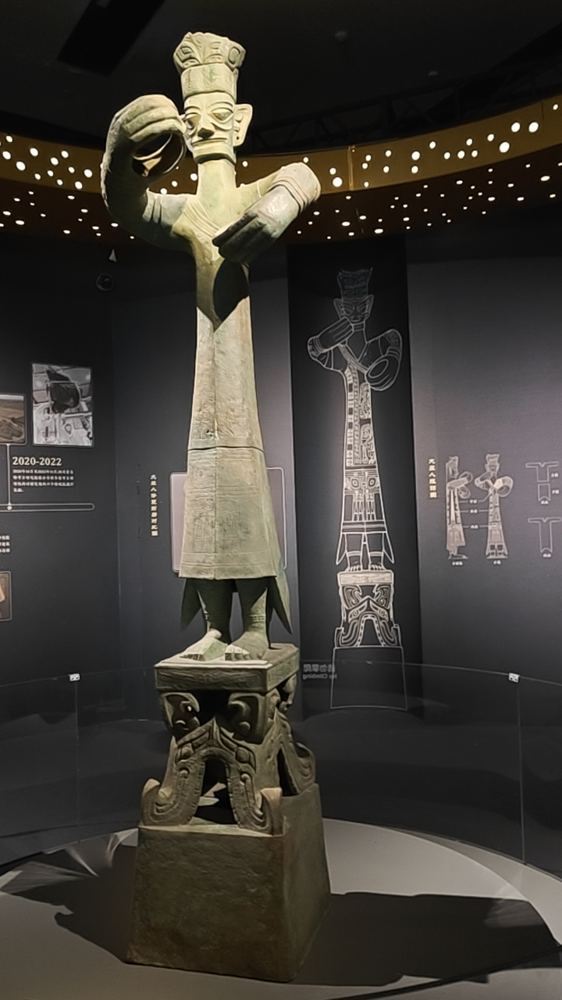

---

## 42. 三星堆青铜人头像群

**年代**：商代晚期（约公元前12世纪—前11世纪），距今约3000年

**出土地**：四川广汉三星堆遗址一号、二号祭祀坑

**现藏**：三星堆博物馆

**展示**：三个青铜人头像并排展出

**头像特征**：
- **粗眉、大眼**：杏仁状/棱形，向外突出
- **高鼻梁、阔口、大耳**（部分耳垂有穿孔，可能挂过饰物）
- 头顶造型各异：有的平顶，有的圆顶（代表不同发式——"笄发"或"辫发"）
- 表情威严神秘，充满宗教祭祀色彩

**身份推测**：
- 代表古蜀国统治阶层或大祭司
- 可能安装在木质/泥塑躯干上，用于祭祀仪式
- 象征沟通天地的神灵或祖先

**为什么与中原不同**：
- 中原商代青铜器以鼎、爵等礼器为主
- 三星堆以**人头像**为主，风格截然不同
- 曾让早期研究者震惊，甚至引发"外星文明"的猜测（当然已被考古学否定）

**意义**：
- 证明了中华文明"多元一体"起源
- 展示古蜀国精湛的青铜铸造技术（分铸法、补铸法）
- 是研究古蜀国社会结构、宗教信仰的"活化石"

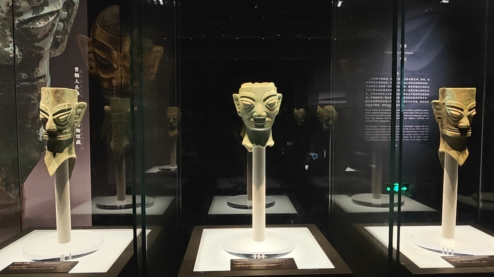

---

## 43. 三星堆"青铜着裙立人像"

**年代**：商代晚期（约公元前12世纪—前11世纪），距今约3000年

**出土地**：四川广汉三星堆遗址

**现藏**：三星堆博物馆

**外观**：
- 全身青铜铸造，比例夸张
- 头戴**花冠状/太阳纹**头饰
- 面部：粗眉、大眼（杏仁状略凸出）、阔口、大耳（耳垂有圆孔）
- 身穿长袍，衣摆宽大，刻有龙纹、云雷纹、鸟纹
- **双手环抱于胸前**，左手在上，右手在下，手心呈圆孔状
- 赤足站立在两层方形基座上

**姿态说明**：
- 展牌标注"**青铜着裙立人像**"
- 双手巨大，原本可能握有祭祀器物（象牙或权杖，现已失传）

**身份推测**：
- 古蜀国**大巫师或国王**（政教合一领袖）
- 华丽冠冕和繁复纹饰象征极高权力

**地位**：
- 世界上发现的年代最久远、形体最高大的青铜人像之一
- 被称为"**东方巨人**"

**意义**：
- 证明长江流域与黄河流域同属中华文明母体
- 打破"中华文明起源于中原"的单一论调
- 展示中华文明"多元一体"格局

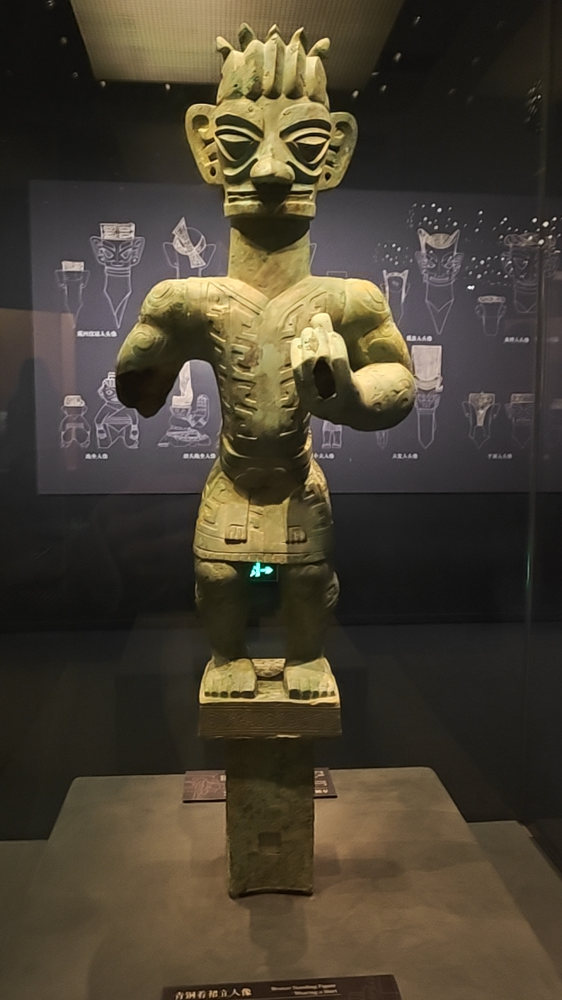

---

## 44. 三星堆青铜骑兽顶尊人像

**年代**：商代晚期，距今约3000-3200年

**出土地**：四川广汉三星堆遗址（3号或8号祭祀坑）

**结构（三层叠加）**：

**① 底部——神兽**：
- 四足站立，头上有角，身躯粗壮
- 布满精美云雷纹等纹饰
- 作为整个器物的基座

**② 中部——立人像**：
- 站立于神兽背上
- 三星堆典型面部：粗眉、大眼、高鼻、阔口
- 身穿长袍，双手向上托举
- 表现祭祀或奉献的姿态

**③ 顶部——大口尊**：
- 体量巨大的青铜尊
- 口部外撇，装饰繁复的兽面纹、鸟纹
- 有突出的扉棱

**宗教意义**：
- 人像头顶大尊，表现祭司举行仪式的神圣场景
- 神兽+人像+尊的组合，象征沟通天地人神的媒介

**文化融合的见证**：
- **顶部尊**：中原商文化常见器型
- **中部人像+底部神兽**：古蜀文明特有风格
- 说明3000多年前古蜀与中原已有深刻文化交流

**工艺价值**：
- 需要极高的分铸和焊接技术
- 代表当时世界领先的金属加工水平

**地位**：
- 三星堆遗址"镇馆之宝"级别

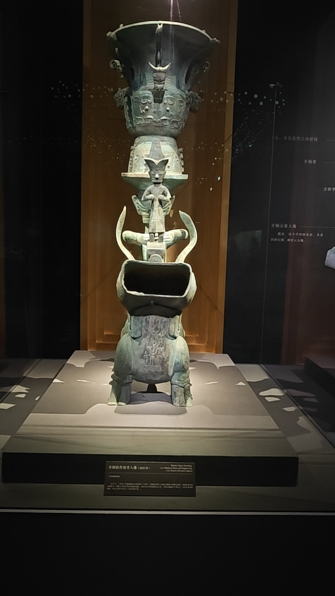

---

## 45. 三星堆一号青铜神树

**年代**：商代晚期（距今约3200-3000年）

**出土地**：四川广汉三星堆遗址二号祭祀坑

**现藏**：三星堆博物馆

**尺寸**：**高约3.96米**——目前世界上发现的最大的单体青铜器之一！

**外观（三部分组成）**：

**① 底座**：
- 圆锥状，由三面弧形基座组成
- 象征神山

**② 树干**：
- 笔直向上，分为**三层**

**③ 树枝**：
- 每层三根，共**九根树枝**
- 树枝呈柔和下垂状
- 每根树枝顶端站立一只**昂首张翅的神鸟**
- 全树共**九只神鸟**
- 树干一侧有一条**龙**盘旋而下（龙头朝下，尾在上）
- 树上还挂满花蕾、果实、云气等装饰

**神话意义**：
- 可能代表古代神话中的**"扶桑"**或**"若木"**——连接天地人神的神树
- "**十日传说**"：九只鸟代表九个太阳（还有一日在天上值班）
- 是古蜀人祭祀的重要法器，象征"**通天神柱**"

**工艺**：
- 不是一次铸成
- 用套铸、铆铸、嵌铸等多种复杂工艺
- 展示3000年前古蜀文明极高的科技水平

**地位**：
- 三星堆文明的巅峰之作
- 世界最大单体青铜器之一

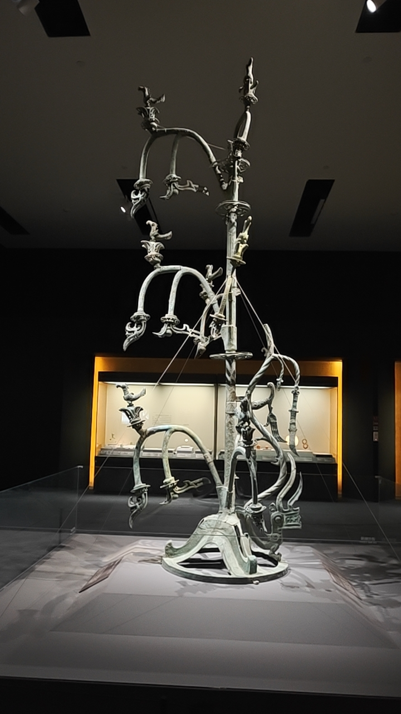

---

*持续更新中...*
